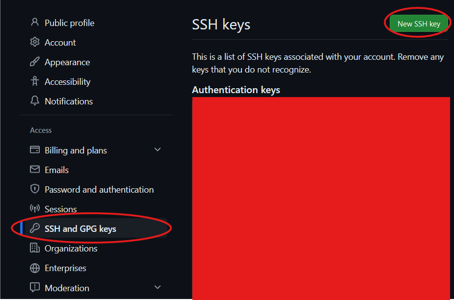

# A1: Programs to Processes

This assignment explores how a C program is transformed into a running process!

You will learn how to **compile** a C program into assembly and how to **assemble** and **link** files into a final executable!

We will be inspecting the underlying **assembly** language. We will making small modifications to the assembly itself and even calling an **assembly function** from C!

Finally, we will write a small program that performs a system call directly to see how user programs interact with the operating system. 

After doing these steps, low-level execution will be less of a mystery! We will understand exactly what happens when we run a C program on an Intel x86 CPU.

## Part 0: Setup 

In the first half of the course, you will be working with low-level hardware and the operating system. In order to ensure that everyone has the same experience-- we must all have access to the same Operating System (Linux) and the same CPU hardware (Intel x86).


#### Option 1: Google Colab

The following github colab notebook provides a few cells that setup google colab correctly.
[https://colab.research.google.com/drive/1b6DADdkfC2UlhqI71DEpV0K1WEga1o6-?usp=sharing](https://colab.research.google.com/drive/1b6DADdkfC2UlhqI71DEpV0K1WEga1o6-?usp=sharing)

1. (FIRST TIME ONLY) Run the first two cells in the google colab notebook. 
    - Note that this notebook automatically runs the process described in the "Adding an SSH Key" section. Then, it moves the ssh key to your google drive so that it can be loaded any time you start a new colab session. You will need to copy the ssh public key to github.com as described in the later section.
2. (Second Time and After) Any time your runtime restarts you will need to run the two notebook cells under the "Every Time Your Runtime Resets" title card.
3. Click on the bottom panel's "Terminal" button. You now have access to a linux shell from which you can clone github repositories and do assignments.
4. **BE AWARE.** When the google colab runtime resets you will **loose all work** in the root + `content/` directory. 
	- You have two options: Save your work **ONLY** in `/content/drive/MyDrive` or back it up on a personal private Github repo. 


#### Option 2: Github Codespaces

We recommend that you complete this assignment on Github Codespaces.

To get started:
- Go to GitHub Codespaces: [https://github.com/codespaces]
- Hit "New Codespace" Green Button
- Either use a "blank" project or start from this assignment repository.


#### Option 3: Personal Computer

BEWARE: You can not complete this assignment on a CPU that is not Linux/Intel x86. 

If you want to run this assignment on a different machine (not Github codespaces) it is your responsibility to check your CPU/OS via the the command: 
```
$ uname -a
Linux annaad-ThinkPad-X1-Carbon-Gen-12 6.17.0-35-generic #35~24.04.1-Ubuntu SMP PREEMPT_DYNAMIC Tue May 26 19:30:42 UTC 2 x86_64 x86_64 x86_64 GNU/Linux
```

If you see `x86_64` and `GNU/Linux` you can do this exercise! Otherwise: use Github Codespaces!!


### Adding an SSH Key to GitHub

Run the following commands in a terminal in your online environment.

1. `ssh-keygen`: This will start the creation of an 'RSA' key pair.
2. If prompted for a file to save the key in, just press enter/return to use the default file path.
3. If prompted for a passphrase, just press enter/return to use the default of no passphrase.
4. If prompted to enter the same passphrase again, just press enter/return again.
5. `cat ~/.ssh/id_rsa.pub`: This will output the public key you've created. 
    - Fun fact: `~` is a shortcut / wildcard character that is equivalent to your home directory. For the online environment, `~/.ssh` is the same as `/home/jovyan/.ssh`. It's useful to know for getting around the terminal quickly. Despite the naming , `~` is **NOT** equivalent to `/home/`.
6. Copy the entire output of the previous command.

Example Input/Output:
```
$ ssh-keygen
Generating public/private rsa key pair.
Enter file in which to save the key (/home/jovyan/.ssh/id_rsa):
Enter passphrase (empty for no passphrase):
Enter same passphrase again:
Your identification has been saved in /home/jovyan/.ssh/id_rsa
Your public key has been saved in /home/jovyan/.ssh/id_rsa.pub
The key fingerprint is:
SHA256:ABunchOfRandomLettersAndNumbers
The key's randomart image is:
+---[RSA 3072]---+
|                |
|   Random       |
|                |
|     Characters |
|                |
|                |
|   Here         |
|                |
|                |
+----[SHA256]----+
$ cat ~/.ssh/id_rsa.pub
ssh-rsa YourPublicKeyHere
```

Now, let's register the public key with your GitHub account.

7. Go to https://github.com and log into your account.
8. Click your profile avatar (typically on the top right) and go to Settings.
9. On the left hand side (or on the top if you're on mobile or have a small browser window), select 'SSH and GPG Keys'
10. On the top right, select 'New SSH Key'.



11. Give your key a fun title! It won't impact how the key works.
12. Confirm the key type is an Authentication Key
13. Paste the previously copied public key into the provided text box.
14. Click 'Add SSH Key' and complete 2-factor authentication if necessary


With that, you should be good to go to clone repositories via SSH. But we need to make one more adjustment to commit to those repositories in the terminal.

### Running Terminal Commands

Run the following commands in your terminal. An explanation of what each line is provided for understanding.

1. `pwd`
    - Outputs your current working directory to a file stream known as 'standard output'. In this case, standard output just goes to your terminal screen.
2. `cd drive/MyDrive` (IF YOU ARE ON GOOGLE COLAB, otherwise you can skip this step.)
	- `cd` stands for 'change directory'. We're asking the shell program to go to directory `drive/MyDrive`. If there is no prefix, such as  `/` (root directory), `./` (current directory), or `../` (parent directory), we assume the directory is a subdirectory of your current working directory.
	- **In google colab, only files in the `/content/drive/MyDrive` folder will be saved and persisted across sessions**
2. `git clone git@github.com:<repository-name>.git` where you replace 
`<repository-name>` with the name of the repo you wish to clone to your computer. On the github website, there is a green "Code <>" button, and under the "ssh" tab you can find the exact command to copy with your repo name. Then, if you see a message **Are you sure you want to continue connecting?**, type yes in your current terminal.
    - Clones your repository on Github into your local device so you can work with it locally. You can think of 'cloning' as 'creating a local copy'.
3. `cd Assignment-1`  
	- `cd` stands for 'change directory'. We're asking the shell program to go to directory `Assignment-1`. If there is no prefix, such as  `/` (root directory), `./` (current directory), or `../` (parent directory), we assume the directory is a subdirectory of your current working directory.
4. `pwd`
    - See line #1. You should notice that the output you see has changed to reflect the new working directory as a result of the previous `cd` command.
5. `ls -l`
    - `ls` lists the contents of the current working directory. The -l flag provides additional information about the directory's contents.
	- You should see files like `mini.c`, `calc.c`, etc.

**NOTE: You will not have the ability to push code changes to the source repository. If you wish to save your work on a git repository you will need to delete the `.git` folder and initialize a new git repo.**

#### Optional: Setting up Personal Private Repository for an Assignment

If you are experienced with git and version control, it's a good idea to back up your work in a **private** git repository.

To do so:
- Go to github.com and click "New Repository".
- Make sure the repo is **private**
- In the terminal that you have cloned `Assignment-1` to, run the following commands:

```shell
$ rm -rf .git
$ git init
$ git add .
$ git commit -m "initial commit"
$ git remote add origin <PASTE_YOUR_REPOSITORY_URL>
$ git branch -M main
$ git push -u origin main
```


## Part 1: Our first C program

`mini.c` contains three partially written functions:

```c
unsigned long long sort(long long x);
unsigned long long branch(long long x, long long y);
int loop(int x, int y);
```

Read the comments in mini.c and fill in the blank lines.

> [!IMPORTANT]
> **TASK: Complete the logic in mini.c.**

## Part 2: gcc + Compiling an executable

To execute a c program, one must first **compile** it. 

At a high level:

```
C program (.c) -> [Compiler] -> Assembly Code (.S) -> [Assembler] -> relocatable object file (.o) -> [Linker] -> Executable 
```

Compiling refers to two things:
1. A specific step in the above toolchain
2. The entire process of turning c code into an executable.

The `gcc` compiler is one specific compiler (gnu c compiler). By default, gcc will run all of the above steps to produce an executable.

Run:

`gcc test.c mini.c -Wall -o test-mini` in your terminal.

You will see a new file `test-mini` when you type `cd`.

Run: `./test-mini ALL` to run your program.
You should see:
```console
$ ./test-mini ALL
Test Sort                : 1/1
Test Branch              : 1/1
Test Loop                : 1/1
Test Sort 2              : 0/1
Total: 3/4
```

Now, instead of running the `gcc` command by hand each time we want to build an executable we want to **automate** the build process with `Makefile`.

A simple makefile rule can resemble the following:
```
	final: test.c final.c
		gcc test.c final.c -Wall -o final
```
This rule describes how to make `final` from **dependencies** `test.c` and `final.c`. When trying to make `final` it will run all the commands that follow.

Notice the provided `Makefile` has the functionality that if you want to delete partial files, you can run the rule: `make clean`.


> [!IMPORTANT]
> TASK: Modify the `Makefile` such that running `make test-mini` compiles `mini.c` and `test.c` into the final executable `test-mini`. 


## Part 3: Compiling + Inspecting Assembly Code

Now, we wish to understand the following portion of the compilation process.

```
C program (.c) -> [Compiler] -> Assembly Code (.S)
```

Assembly is a low level programming language that directly corresponds to the CPU's architecture. Assembly instructions are analogous to operations that the CPU hardware supports. The set of instructions a CPU supports is known as an ISA (instruction set architecture). 

For example, an `add` instruction in assembly, triggers a specific path through the intel x86 processor, utilizing the underlying hardware to perform the operation. 

Instructions in assembly operate on **registers**. There are 8 general purpose registers in the x86 architecture. Registers are small units of data storage, each holding 64 bits (on a 64 bit cpu).

Now, run the following instruction:

```
	gcc -fno-inline -fno-stack-protector -fno-pic  -static -Werror -fcf-protection=none -fno-asynchronous-unwind-tables -Os -S -masm=intel mini.c -o mini.s
```

There are a lot of flags on this gcc command, most of which you can ignore. However, one key one is the **-S** flag. This flag tells the gcc compiler to stop after the first step, spitting out, not an executable but instead an assembly code file.

Let's take a look at `mini.s` directly.

Notice, the file is quite long. Let's take a look specifically at the portion corresponding to our `sort` function. 

> [!IMPORTANT]
> **TASK: Copy mini.s to a new file mini_mod.S, change how the sort function works!**
> - The new behavior should be that 11 if x > 5, otherwise returns 17.
> Modify the makefile such that running `make test-mini2` compiles `mini_mod.S` and `test.c` into the final executable `test-mini2`. 

Now if you run `make test-mini2` and `./test-mini2 3` you should see:

```console
$ make test-mini2
gcc -Wall   -c -o test.o test.c
as   -o mini2.o mini2.s
gcc test.o mini2.o -o test-mini2
$ ./test-mini2 3
Test Sort 2              : 1/1
Total: 1/1
```
## Part 4: Assembling + Linking

Finally, we wish to understand the following part of the compilation process:

```
Assembly Code (.S) -> [Assembler] -> Relocatable Object File (.o) -> [Linker/Loader] -> Executable
```

The assembler takes as input an assembly file, and produces a relocatable object file.
You can invoke the assembler with the `as` command.

The linker/loader can link together **multiple object** files! For example, you may have several libraries and other code that you want to link together to form one final executable. 
You can invoke the linker with the `ld` command.

`gcc` can act as the assembler with the -c flag. This flag tells gcc to stop after the assembler phase and produce a relocatable object file (.o).

For example:
```console
$ ls
input.c
$ gcc -Wall -c input.c 
$ ls
input.c input.o
```

`gcc` can also directly take in multiple object files to produce an execuable.

For example:
```
$ gcc -Wall input1.o input2.o -o output
```


You will complete the implementation of a simple calculator program. This calculator program takes in an array of operation structs which specify a character for the **operation type** and two integer inputs `a` and `b`.

Notice, how is it possible that our function written in assembly can be called by C code? The mystery function is callable because it follows the C calling convention. The C calling convention dictates an order of registers for parameters, which register to use for return values, and how to setup/teardown **stack frames**.

> [!IMPORTANT]
> **TASK: Complete calc.c and modify the Makefile such that the final calc executable is made from mystery.o and calc.o.**

You will notice there is no mystery.c, only mystery.S. It is perfectly normal in systems-level programming to write a few key functions in assembly and link them together with C code.

Once you complete this step running `make calc` and `./calc` you should see:
```console
$ ./calc
1517
```

## Part 5: Syscalls

Now, how can a process interact with the system? How can a process print out information to the terminal? How can a process get input from the user? How can a process open a file stored in disk?

All these tasks require support from the operating system. The way a process can interact with the operating system is via **syscalls**.

Take a look at `caller.c`.

> [!IMPORTANT]
> **TASK: add two new "write" syscalls.** 
>	- One should write a string "hello STDOUT\n" standard out. 
>	- The other call should write a string "ERROR: this is an error" to standard ERROR.

Again, let's inspect what this code looks like in assembly:

```console
$ gcc -fno-inline -fno-stack-protector -fno-pic  -static -Werror -fcf-protection=none -fno-asynchronous-unwind-tables -Os -S -masm=intel caller.c -o caller.s
```

Now, run `strace ./caller` in your terminal.

Here, you will see a list of syscalls made by the ./caller process.

> [!IMPORTANT]
> **TASK: Answer these questions in questions.txt**
> - Which lines of the output syscalls correspond to the two you added? (Label your answer with `(1)`. This label must come at the start of the line.)
> - What is one other syscall (not write) that you see in the output. Look it up and describe what this syscall does. (Label your answer with `(2)`. This label must come at the start of the line.)

## Submitting on Gradescope

To submit on gradescope, submit all the files in this directory to the assignment upload.

You should see the autograder run and report a score. Ensure that you are happy with this score! Feel free to resubmit as many times as you wish before the deadline.


